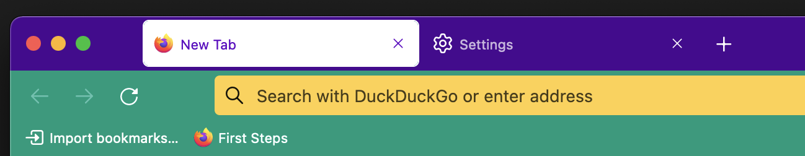

# Anorak Firefox Theme

https://addons.mozilla.org/de/firefox/addon/anorak/

## Get yourself some fresh colors and think about the eighties. :)

This Theme has been created with [Firefox Colors](https://color.firefox.com/). 
You can create your own remix with the latest settings: [Remix me](https://color.firefox.com/?theme=XQAAAALgAgAAAAAAAABBqYhm849SCicxcUJJ2CuG_ebZUZXOFqiCdRj0qZINw__kcRFI-KdqIJvDssaqBS-tmKVnKVxbeYWfC9ih3T44HtAMB43Cm76bxQug_5IM3eDlDVgbDXAk3SOOhbHQ-3YmcbUN--HPZx7fIAD306FlAo4F_SMigFicPFcheeuTwopsaaWyGOl0mYbZhQbOe2HGtuHZbF1Cvh63YKtlEKpPVbxW6B32f2hAOnJMCRgpH_5M7iwCnqEwIVH7jS0437gkvtltuOYfvvKr6njzjrRxRgA41_pl9tyoPq-5IsU1uAhMgkXu8eFxspmfUH7-ZxCXd5rylTUX4eNM61N1IqNNOXWWfmAImQuxhcZhO9ecLXxv1wVztZYk-b_Xq81RhWN4EY5Z05yINzYe7VQnp04WWtSQ7JBoj0qxAZLHKajNhk2rxzOMg5QBft5g6A3_8xOAKA).

Version 1.2 It been tested on Windows and MacOS, not on FF Android yet. 

